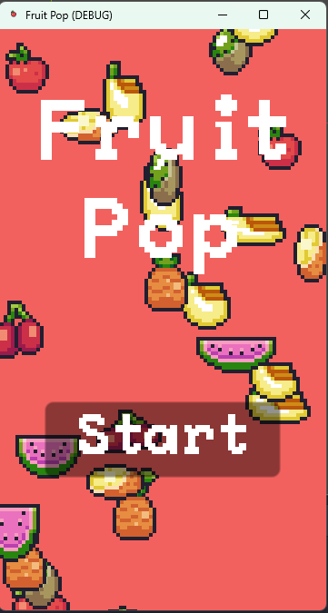
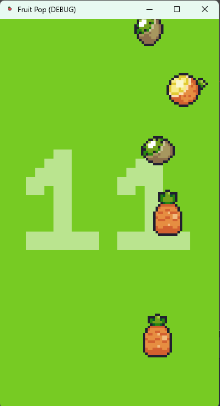
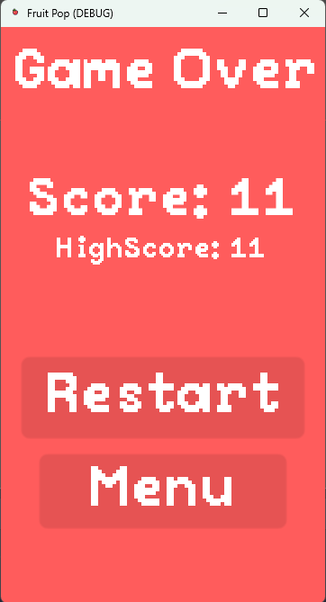

Made a simple mobile game in Godot to teach myself about game development.

<h2>Title Screen</h2>

<h2>Game Screen</h2>

The player must tap on the fruit whose color matches the background. If a wrong fruit is tapped or the correct fruit slides off the screen, the player loses.

<h2>Lose Screen</h2>

The player's high score is tracked. When they beat their score, the high score lable will update.

